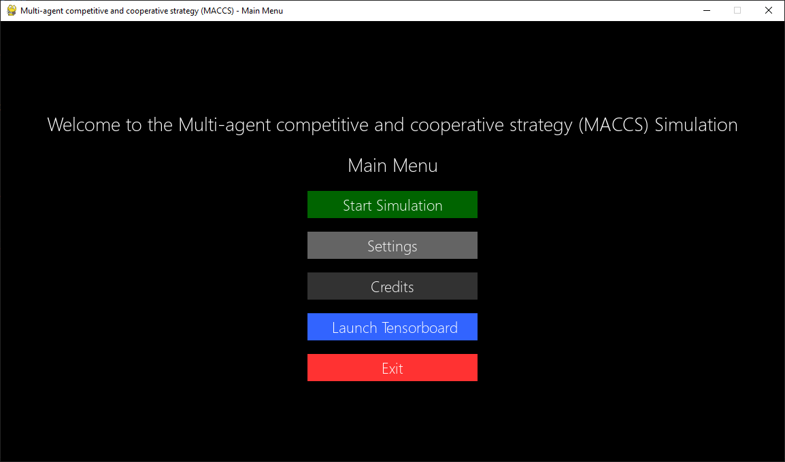
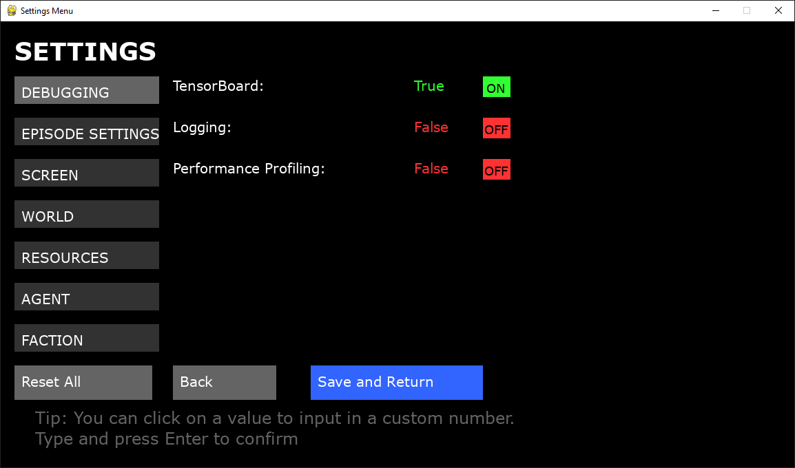
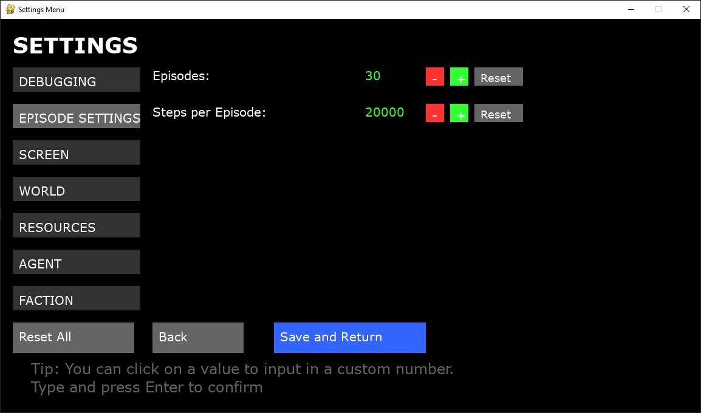
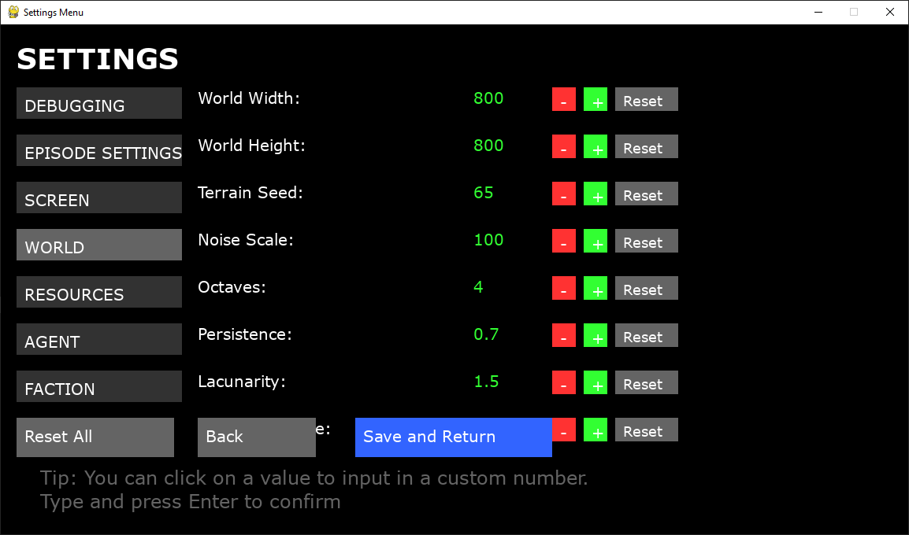
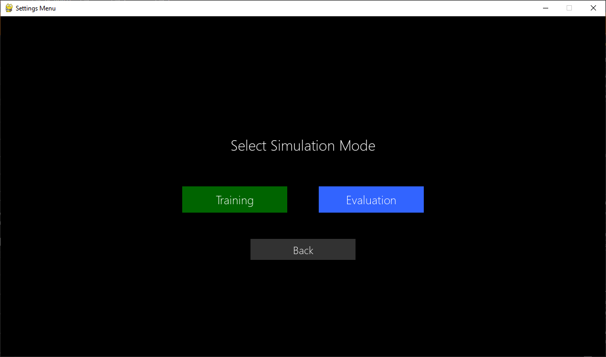
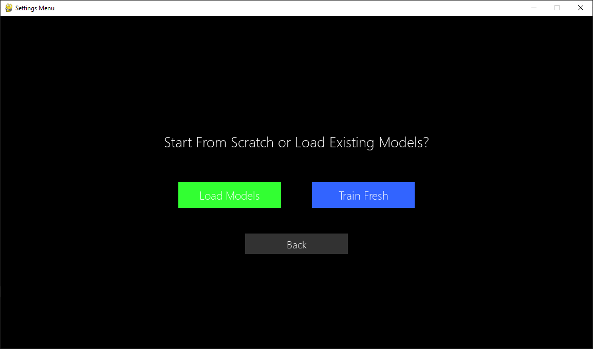
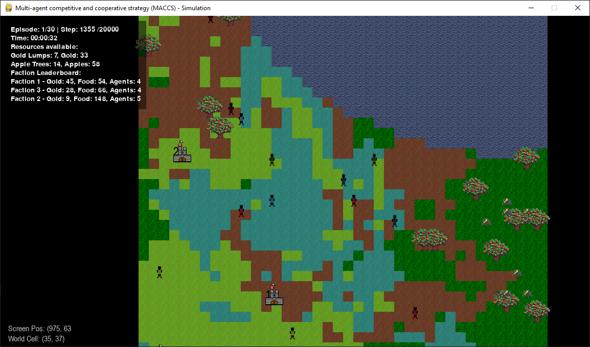
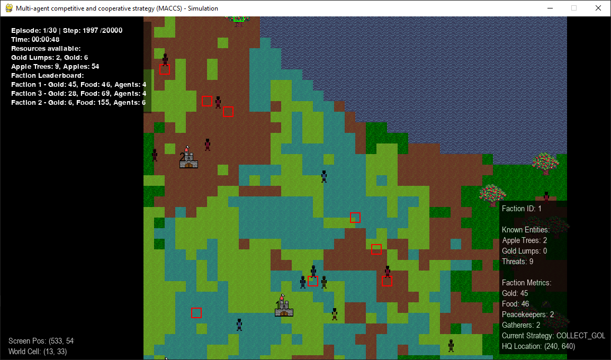
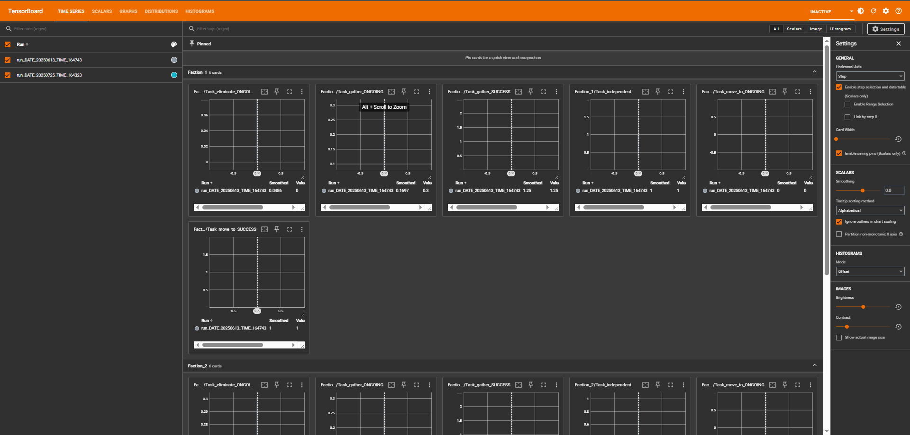
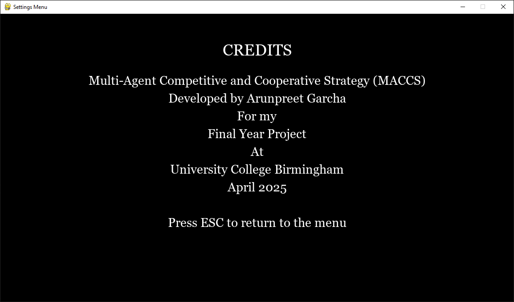

# MultiAgent Faction Wars

A Python-based multi-agent simulation game that explores emergent behaviors through competitive and collaborative agent interactions. This project demonstrates advanced AI concepts including reinforcement learning, neural networks, and complex multi-agent systems.

## Overview

MultiAgent Faction Wars is an interactive simulation environment where multiple AI agents compete and collaborate within faction-based groups. The system features:

- **Multi-Agent Non-Static Environment**: Dynamic, ever-changing simulation where agents must adapt to evolving conditions
- **Multi-Agent Reinforcement Learning**: Agents learn through experience using PPO algorithms (DQN Future works)
- **Faction-Based Competition**: Agents form alliances and compete for resources and territory
- **Emergent Behaviors**: Complex strategies emerge from simple agent interactions
- **Real-Time Visualisation**: Live game rendering with customizable settings
- **TensorBoard Integration**: Comprehensive metrics tracking and analysis
- **Neural Network Architecture**: Custom attention mechanisms and hierarchical networks

The project serves as both an educational tool for understanding multi-agent systems and a research platform for studying emergent behaviors in competitive environments.

**Developed in Python 3.9.7**

## Documentation

- **[Quick Start Guide](Documentation/QUICK_START.md)** - Get up and running in minutes
- **[Architecture Overview](Documentation/ARCHITECTURE.md)** - System design and component structure  
- **[Developer Guide](Documentation/DEVELOPER_GUIDE.md)** - Extending the system and contributing
- **[Changelog](CHANGELOG.md)** - Recent updates and improvements

## Getting Started

Before running the project:

1. Ensure **Python 3.9.7** is installed. (https://www.python.org/ftp/python/3.9.7/)
2. Make sure you're in the correct project directory:`/MultiAgent Faction Wars`
3. Run the project using:

The system includes a basic dependency checker. If any dependencies are missing, it will prompt you to install them.

### Multi-Agent System

Collaboration and competitiveness are core to this project.
However, agent behaviour might not always be clear during runtime.

TensorBoard Integration
TensorBoard is used to track various metrics and help identify trends over time.
It can be launched while the main app is running or afterwards.
Metric data is logged either in real-time or at the end of each episode, depending on the specific metric.

### Customisation

You can customise project settings in the utils_config.py file.
Examples include:

- Number of agents
- Factions
- World and screen settings

Look for comments like "Customise as needed!" throughout the code to easily find configurable sections.

## Features

### Recent Improvements (See [CHANGELOG.md](CHANGELOG.md))

- **37.6% Performance Improvement**: Runtime reduced from 88s to 55s per episode (Logging OFF)
- **Peacekeeper Block Ability**: Defensive stance with attack detection
- **Gatherer Planting**: Plant trees and gold veins for long-term resource production
- **HQ Health System**: HQs can be attacked and destroyed
- **Pause Menu**: ESC to pause, M to restart, Q to quit
- **Persistent Settings**: Settings saved across runs
- **Resource Growth System**: Planted trees grow through 6 stages
- **Enhanced Rewards**: Context-aware and outcome-based reward systems
- **Threat Intelligence**: "Last known" threat tracking
- **Settings Menu Audit**: Removed unimplemented features, responsive scaling

### Core Features

- **Multi-Agent Reinforcement Learning**: PPO agents learning in real-time
- **Hierarchical Decision-Making**: Agents (tactical) + HQ (strategic)
- **Faction-Based Competition**: 2-6 factions competing for resources
- **Emergent Behaviors**: Complex strategies from simple rules
- **Real-Time Visualization**: Live gameplay with camera controls
- **Neural Network Training**: Automatic model saving and loading
- **TensorBoard Integration**: Comprehensive metrics tracking
- **Terrain Generation**: Procedural land/water generation
- **Resource Management**: Food and gold collection systems
- **Threat Detection**: Agent-to-agent and agent-to-HQ targeting

## Screenshots

### Main Game Interface

### Setup and Configuration

### Simulation Setup

### Gameplay

### Monitoring and Credits

